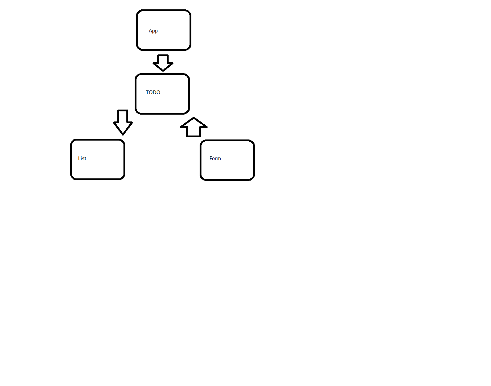
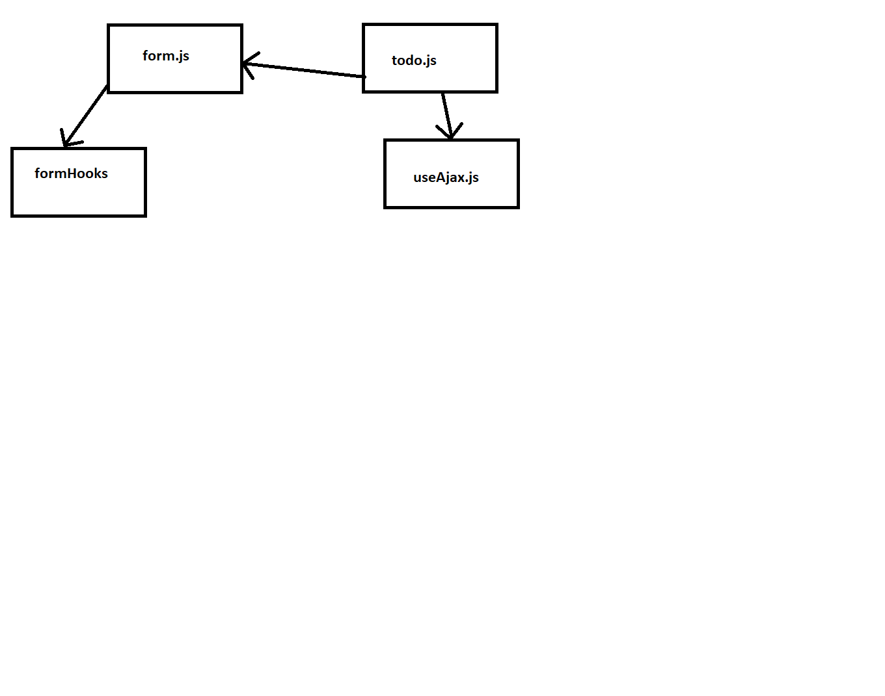

# TODO

## Class-31

### TODO

#### Links

[PR](https://github.com/yaljamal-401-advanced-javascript/todo/pull/2)

#### Modules

_ `form.js` _
_ `list.js` _
_ `todo.js` _
_ `todo-connected.js` _
_ `app.js` _

#### Tests

Lint test: npm run lint

#### UML

